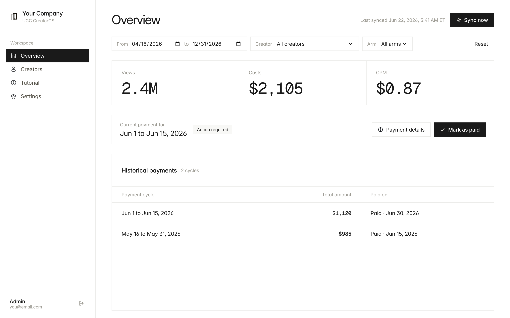
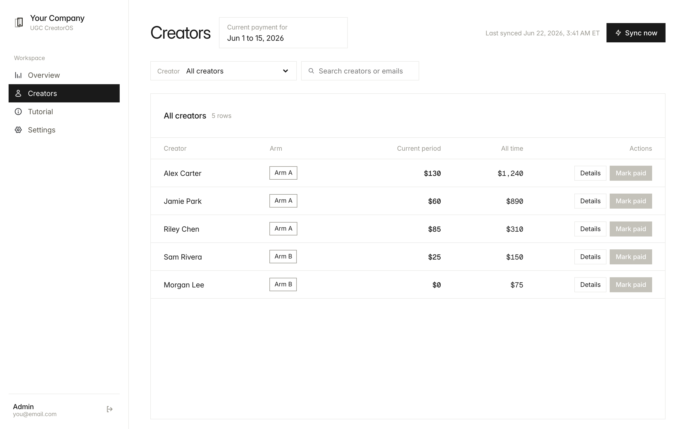
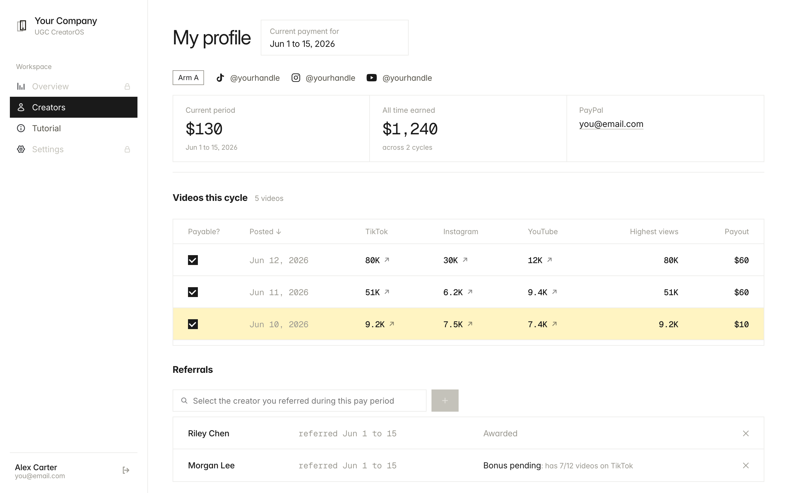
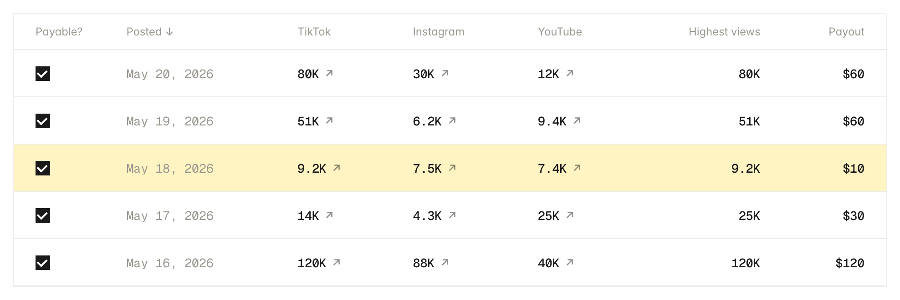
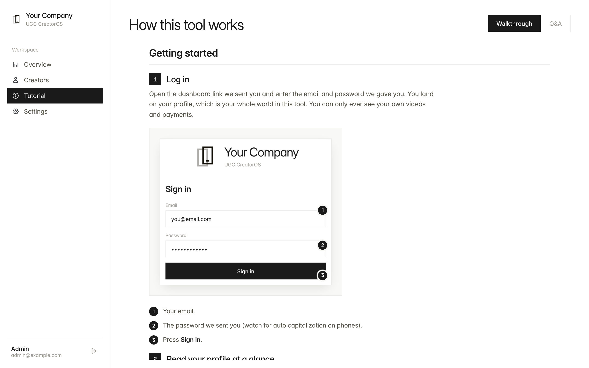

# UGC CreatorOS

**The OS for your creator program.**

Run a short-form creator program end to end: track every TikTok, Instagram Reel, YouTube Short, and Facebook Reel your creators post, recognize when the same video was cross-posted to several platforms, turn views into tiered payouts on a bi-monthly cycle, and give every creator a self-serve portal to check their earnings. One codebase covers the payout engine, the analytics, and the creator CRM layer that programs usually stitch together from spreadsheets.



## What it does

**Payout engine**
- Bi-monthly pay periods (1st to 15th, 16th to end of month) with a hard midnight ET cutoff
- View-tiered payout structure per program arm (two arms included, fully editable in the UI)
- Pays once per video at the highest view count across platforms, never double-paying a cross-post
- Snapshot locking: when a period is marked paid, amounts freeze permanently and can never be silently rewritten
- Per-creator or whole-cycle "mark paid" flows, CSV export per cycle
- Referral bonuses: creators earn a flat bonus when someone they referred hits the qualifying video count, awarded automatically

**Tracking and matching**
- Twice-daily sync of every creator's videos via a stats vendor (Shortimize out of the box; the client is one small file you can swap)
- Cross-post detection with perceptual hashing: cover frames are fetched per platform, hashed, and matched with a tiered threshold system plus date and length guards
- Union-find grouping so a TikTok, Reel, and Short of the same video become one payable row
- Manual "Link Post" override for pairs the auto-matcher cannot see, available to admins and to creators on their own videos
- Ghost sweep: platform-level liveness probes flag deleted videos so removed content stops being paid
- Auto-heal for renamed handles, collab-post ownership rules, hashtag-based ingest filters per creator

**Creator CRM and portal**
- Roster management: handles per platform, program arms, PayPal, soft delete, activity log of every admin action
- Creator logins: each creator sees only their own profile, videos, and earnings
- Creators can confirm or exclude their own videos for payout, link their own cross-posts, and submit referrals
- Built-in Tutorial tab: an illustrated in-app guide plus Q&A so creators onboard themselves

**Analytics and ops**
- Overview dashboard: KPIs, per-cycle totals, payment history, per-creator breakdowns
- Sync engine with per-creator subprocess isolation, concurrency guards, and run history
- Every payout-affecting action is auditable

## Screenshots

The creator roster with per-creator payouts and mark-paid actions:



The creator portal: each creator sees their own videos, cross-post groups, payouts, and referrals:



Cross-posted videos collapse into one payable row at the highest view count:



The built-in tutorial that onboards creators for you:



All data shown is fictional demo content.

## Architecture

```
Next.js app (Vercel)          Python worker (Render)
  UI + API routes    <----->    FastAPI /sync /recalc
  session auth (JWT)            3 cron jobs (morning / evening / daily)
        |                              |
        +---------- Supabase ----------+
             (Postgres, shared source of truth)
```

- **Frontend + API**: Next.js 15 (App Router), React 19, TypeScript, SWR, hand-rolled CSS design system
- **Worker**: Python, FastAPI, httpx, Pillow + imagehash for perceptual matching
- **Database**: Supabase (Postgres). The app and worker both talk straight to it
- **Auth**: bcrypt password hashes + signed JWT session cookie; roles are Admin and Creator

## Quickstart

1. **Create a Supabase project** (free tier works) at supabase.com
2. **Apply the schema**: paste `supabase/schema.sql` into the Supabase SQL editor and run it. This creates all tables plus fictional demo creators
3. **Optional, recommended for a first look**: run `supabase/seed_demo.sql` too. It adds fake videos, cross-post groups, and a referral in the current pay period so the dashboard looks alive
4. **Configure env**: `cp .env.example .env.local` and fill in your Supabase URL and keys, a random `JWT_SECRET`, and a random `WORKER_SECRET`. The placeholder values for everything else are fine until you go live
5. **Install and run the app**:
   ```bash
   npm install
   npm run dev        # http://localhost:3000
   ```
6. **Seed logins**:
   ```bash
   pip install -r worker/requirements.txt
   python -m worker.seed_users
   ```
   Then sign in as `admin@example.com` / `changeme-admin` (or a demo creator like `alex@example.com` / `changeme-creator` to see the creator portal)
7. **Run the worker** (only needed for real syncing, not for browsing demo data):
   ```bash
   python -m uvicorn worker.main:app --port 10000
   ```

## Going live

- **App**: deploy to Vercel (config in `vercel.json`), set the env vars from `.env.example`
- **Worker + crons**: deploy to Render with `render.yaml` (one web service + three cron jobs), set the same env vars
- **Stats vendor**: add your Shortimize API key, or adapt `worker/shortimize.py` to your vendor. The rest of the pipeline only needs `username`, `platform`, `ad_link`, `uploaded_at`, and `latest_views` per video
- **Make it yours**: replace `public/assets/logo-mark.svg` and the "Your Company" strings in `src/components/Sidebar.tsx`, `src/components/DashboardShell.tsx`, and `src/app/login/page.tsx`; adjust payout tiers in Settings or in `supabase/schema.sql`; change the seed passwords before inviting anyone real

## Repo map

```
src/app            Next.js routes (dashboard, login, api/*)
src/components     UI: overview, creators, settings, tutorial
src/lib            shared types, payout + cycle logic, hooks
worker/            Python pipeline: sync, matcher, payouts, probes, crons
supabase/          schema.sql, seed_demo.sql, migrations/
render.yaml        worker + cron deployment
vercel.json        app deployment
```

## License

MIT. See [LICENSE](LICENSE).
